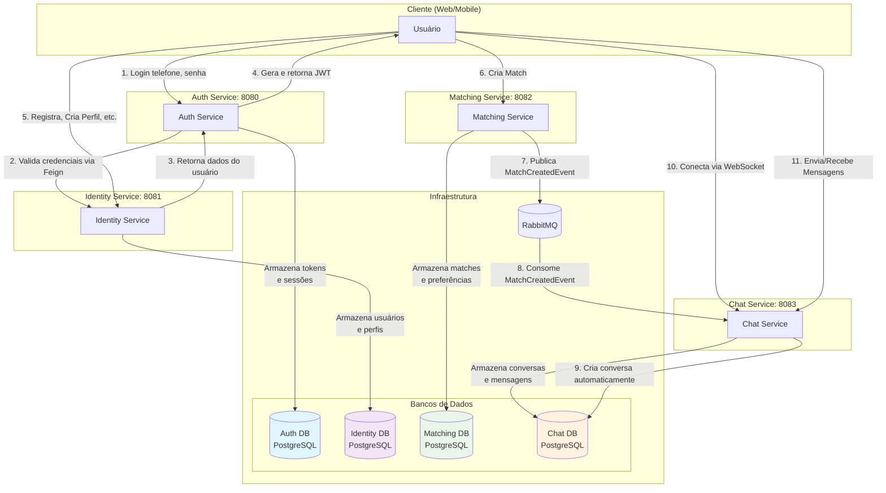
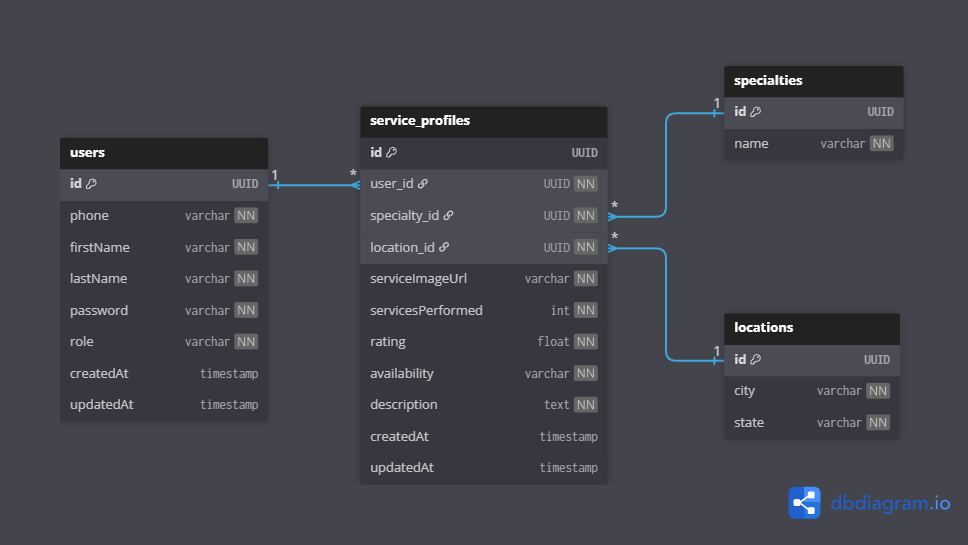
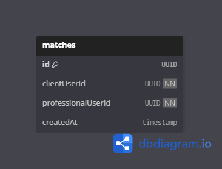
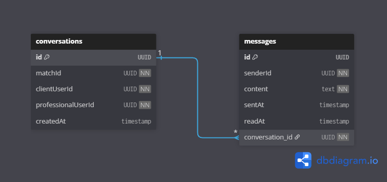

# Jobinder - API Backend 🚀

Jobinder é uma plataforma projetada para conectar profissionais que oferecem serviços a clientes que os procuram, funcionando de forma similar a um "Tinder" para empregos e serviços.

---

## 💻 Tecnologias Utilizadas

- **Linguagem:** Java 17
- **Framework:** Spring Boot 3
- **Segurança:** Spring Security (autenticação JWT)
- **Banco de Dados:** Spring Data JPA, PostgreSQL
- **Testes:** JUnit, Mockito
- **Comunicação**:
  - REST APIs (Spring Web)
  - Comunicação síncrona: Spring Cloud OpenFeign
  - Comunicação assíncrona: RabbitMQ (Spring AMQP)
  - Tempo Real: Spring WebSocket
- **Documentação: SpringDoc OpenAPI 3 (Swagger)**
- **Build:** Apache Maven
- **Containerização:** Docker & Docker Compose
- **Utilitários:** Lombok

## 🏛️ Arquitetura de Microsserviços

O backend da plataforma segue uma arquitetura de microsserviços orientada a eventos, com cada serviço tendo seu próprio banco de dados (Database per Service) para garantir o desacoplamento e a escalabilidade.

### Serviços Principais

- **Auth Service (Porta 8080):** Responsável pela autenticação (`/login`) e geração de tokens JWT. É _stateless_ (sem banco de dados) e consulta o `identity-service` para validar as credenciais do usuário.
- **Identity Service (Porta 8081):** O "serviço de verdade" (source of truth) para identidade. Gerencia o cadastro de usuários (`User`), perfis de serviço (`ServiceProfile`), `Locations` e `Specialties`. Armazena os dados em seu próprio banco.
- **Matching Service (Porta 8082):** Gerencia a lógica de "match" entre um cliente e um profissional. Quando um match é criado, ele salva o `Match` em seu banco de dados e publica um evento `MatchCreatedEvent` no RabbitMQ.
- **Chat Service (Porta 8083):** Consome eventos de match do RabbitMQ para criar `Conversations`. Gerencia a comunicação em tempo real entre os usuários (via WebSockets) e armazena o histórico de `Messages` em seu banco.

### Dependências de Infraestrutura

- **PostgreSQL:** Banco de dados relacional. Cada serviço (Identity, Matching, Chat) gerencia seu próprio schema.
- **RabbitMQ:** Message broker usado para a comunicação assíncrona entre o `Matching Service` e o `Chat Service`.

## Diagrama de Arquitetura



## 🏦 Esquemas de Banco de Dados

Abaixo estão os esquemas de banco de dados para cada serviço.

### Identity Service

<p align="center">
  
</p>

### Matching Service

<p align="center">
  
</p>

### Chat Service

<p align="center">
  
</p>

## ✅ Testes Unitários

O projeto possui uma suíte de testes unitários para garantir a confiabilidade da lógica de negócios e a integridade dos dados.

- **Cobertura:**
  - Testes cobrem todos **Microservices** (`Auth Service`, `Identity Service`, `Matching Service`, `Chat Service`).
  - Validação de cenários de sucesso ("caminho feliz") e tratamento de exceções (erros de negócio, dados inválidos).
  - Testes de integridade de dados e mapeamento de DTOs.

### Como Rodar os Testes

**Opção 1: Script Automatizado (Recomendado)**

Na raíz do projeto, execute todos os testes de uma vez:

```bash
# Linux / Mac / Git Bash
./test-all.sh

# Windows (CMD / PowerShell)
./test-all.bat
```

**Opção 2: Manualmente por Serviço**

Navegue até a pasta do serviço desejado e execute:

```bash
cd ./{service-name}
./mvnw test
```

## 📖 Documentação da API (Swagger)

Após iniciar os serviços (com qualquer um dos métodos acima), a documentação da API de cada serviço estará disponível nos seguintes links:

- **Auth Service:** http://localhost:8080/swagger-ui.html
- **Identity Service:** http://localhost:8081/swagger-ui.html
- **Matching Service:** http://localhost:8082/swagger-ui.html
- **Chat Service:** http://localhost:8083/swagger-ui.html

---

# 🚀 Como Rodar o Projeto

A forma mais recomendada de rodar o projeto é usando Docker Compose, que subirá todos os serviços e a infraestrutura necessária (Banco de Dados e RabbitMQ) automaticamente.

## Pré-requisitos

- Java 17 (ou superior)
- Apache Maven
- Docker e Docker Compose (geralmente já vem com o Docker Desktop)

## Rodando com Docker Compose (Recomendado)

### 1. Clone o Repositório:

```bash
git clone https://github.com/LeoAoun/Jobinder-Backend-Java.git
cd jobinder-backend-java
```

### 2. Configurar Variáveis de Ambiente (Obrigatório):

O docker-compose.yml está configurado para ler segredos (como JWT_SECRET) de um arquivo .env.

### 3. Subir os Containers:

No terminal, na pasta raiz (onde está o docker-compose.yml), execute:

```bash
docker-compose up --build
```

Nota: O --build força o Docker a construir as imagens do zero usando os Dockerfiles de cada serviço. Isso pode levar alguns minutos na primeira vez.

### 4. Acessar os Serviços:

Após os logs estabilizarem, os serviços estarão disponíveis:

- **Auth Service:** http://localhost:8080
- **Identity Service:** http://localhost:8081
- **Matching Service:** http://localhost:8082
- **Chat Service:** http://localhost:8083
- **RabbitMQ Admin:** http://localhost:15672 (login: guest / guest)
- **PostgreSQL DB:** Acessível em localhost:5432 (login: postgres / postgres)

## Rodando Localmente (Alternativa, para Debug)

Você também pode rodar cada serviço individualmente pela sua IDE (IntelliJ, VS Code, etc.).

1. **Inicie as Dependências:** Você precisa ter instâncias do PostgreSQL e RabbitMQ rodando localmente (ou via Docker).
2. **Configure os application.properties:** Certifique-se de que cada application.properties (em cada pasta de serviço) aponte para localhost (ex: spring.datasource.url=jdbc:postgresql://localhost:5432/...).
3. **Inicie cada Serviço:** Abra cada pasta de microsserviço (ex: auth-service, identity-service) e inicie a aplicação Spring Boot (pelo main ou mvn spring-boot:run).
